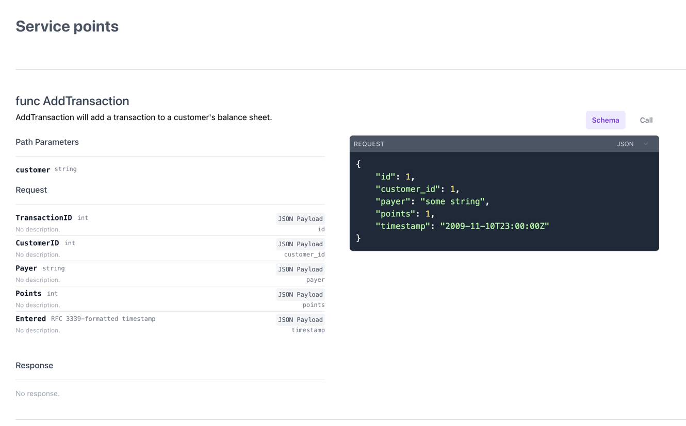

# pointsystems

To run this application, you will need a couple dependencies:

* Install [Encore](https://encore.dev/docs/install)
* Have a recent version of [Golang](https://go.dev)
* Docker will need to be running

## Running the application

```shell
encore run
```

should start a local environment with a Postgres database and server.  You should see a banner after everything starts up
with an admin dashboard and URI for the API:

```
  ✔ Building Encore application graph... Done!
  ✔ Analyzing service topology... Done!
  ✔ Creating PostgreSQL database cluster... Done!
  ✔ Generating boilerplate code... Done!
  ✔ Compiling application source code... Done!
  ✔ Running database migrations... Done!
  ✔ Starting Encore application... Done!

  Encore development server running!

  Your API is running at:     http://localhost:4000
  Development Dashboard URL:  http://localhost:50568/pointsystems-zat2
```

Your URL may vary.

## Testing

Once you have Encore installed, you can run tests similar to how you do with Golang:

```shell
encore test ./...
ok      encore.app/points       1.265s
```

## Testing API calls locally

Encore builds with it an admin dashboard that you can use to make API calls.  The right side will show Schema and have a selector
for making a Call directly.  Simply replace `:id` with `1` if you're running locally.



## Testing API calls remotely

I have deployed a version of this to Encore's Cloud provider.

https://production-pointsystems-zat2.encr.app

## Sample `curl` calls

```shell
# add transaction
curl 'https://production-pointsystems-zat2.encr.app/points/1' -d '{"id":1,"customer_id":1,"payer":"some string","points":1,"timestamp":"2009-11-10T23:00:00Z"}'

# get customer balances
curl 'https://production-pointsystems-zat2.encr.app/points/1'

# create customer
curl -X POST 'https://production-pointsystems-zat2.encr.app/customer/bobbarino'

# spend points
curl -X POST 'https://production-pointsystems-zat2.encr.app/spend/1/500'
```